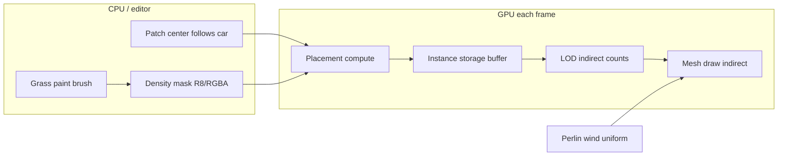

# Stylized World — grass architecture (WebGPU)

Goal: Unreal-like **masked foliage** + **GPU placement** + **wind in shader**, without the old bugs (full-buffer clears, track/grass UV coupling, unstable hashes on moving patches).

## Unreal → this project

| Unreal | Here (Three.js r18x + TSL + WebGPU) |
|--------|-------------------------------------|
| Landscape grass density weightmap | `uGrassMask` texture, world XZ → UV |
| Foliage instance placement | **Compute** writes instance struct buffer |
| Hierarchical LOD / cull distance | 2–3 **indirect draw** buckets by camera distance |
| WPO wind in material | `wind-helpers.ts` → vertex offset, tip-weighted |
| Grass only on slopes & height | Optional: sample terrain height + reject steep normals |
| Paint foliage | Phase 3: brush → mask RT (see `cubic-worlds-game/grass/grass-painter.tsx`) |
| Wheel rut flatten | **Later**, separate `uTrackMask` — never mixed with density mask |

## Data flow



## Core rules (do not break again)

1. **Density mask is authoritative** — no blade if `mask < threshold`. Procedural clumps only *inside* masked areas.
2. **Stable world IDs** — `globalGrid = localCell + uGridIndex` when the patch moves (integer steps), so blades do not reshuffle every frame.
3. **One moving patch** — e.g. 64×64 m around focus; mask UV uses **world coordinates**, not patch-local reset.
4. **No per-frame `fill(0)`** on large CPU textures; tracks use a **separate** small sliding texture later.
5. **Budget caps** — max instances per LOD; compute early-outs (mask, distance, optional frustum).

## Mask texture (future paint)

- **Channel**: R = density 0…1 (linear, `NoColorSpace`).
- **World mapping**:  
  `uv = (worldX - maskCenterX) / maskWorldSize + 0.5` (same idea as old ground-data, but **only for grass density**).
- **Fixed landscape (220 m)**: one 512² or 1024² mask for full bounds.
- **Streaming world**: mask **per tile** (16 m), loaded with ground tiles; compute samples tile atlas or bound texture array later.
- **Default until paint exists**: procedural mask (noise + distance from roads) or all-zero outside test region.

## Wind

Reuse `samplePerlinWindOffset` from `experience/wind-helpers.ts` (already used by bushes).

- Vertex: `offset = wind * pow(heightAlongBlade, 2)` so base stays stiff, tip moves.
- Uniforms: direction, speed, strength, optional distance fade from camera (GUI later).
- Same `getPerlinTexture()` as bushes for visual consistency.

## LOD (phase 2)

| Tier | Distance | Segments | Notes |
|------|----------|----------|-------|
| Near | 0–6 m | 8 | Full bend + wind |
| Mid | 6–20 m | 4 | |
| Far | 20+ m | 2 | Aggressive count cap |

Compute fills each tier’s indirect `instanceCount`; material can use `uDebugLod` color for tuning.

## Phased delivery

### Phase 1 — Minimal visible grass (flat debug)
- Files: `config.ts`, `grass-mask.ts`, `grass-compute.ts`, `grass-material.ts`, `stylized-grass.tsx`
- Flat ground Y=0, **constant mask = 1** in a circle around car (no paint yet)
- Single LOD, wind on, no tracks, no car push
- Wire into `experience.tsx` flat debug only

### Phase 2 — Optimization
- 3 LOD indirect buffers + distance culling in compute
- `uGridIndex` snap when patch center moves
- Optional: grass compute every 2nd frame + interpolate wind only every frame

### Phase 3 — Painted mask
- `GrassMaskSystem`: RT or DataTexture aligned to landscape bounds
- Editor mode: brush radius/strength, erase (port ideas from `grass-painter.tsx`)
- Save/load PNG mask asset optional

### Phase 4 — Gameplay
- Terrain height texture sample (hills)
- Car chassis push (perimeter, not huge radius)
- Wheel track flatten via **separate** imprint texture

## File layout (target)

```
grass/
  ARCHITECTURE.md      ← this doc
  config.ts            ← patch size, blade counts, LOD tables
  grass-mask.ts        ← world UV, sample mask, upload paint data
  grass-geometry.ts    ← blade mesh + instance struct
  grass-compute.ts     ← WebGPU placement + cull
  grass-material.ts    ← TSL billboard blade + wind
  stylized-grass.tsx   ← R3F hookup, patch follow focus
  use-grass-uniforms.ts
  use-grass-compute.ts
```

## References in repo

- Wind: `experience/wind-helpers.ts`, `experience/bush-material.tsx`
- Tile paint prototype: `cubic-worlds-game/grass/grass-painter.tsx`
- Height-from-texture idea: `cubic-worlds-game/grass/glibli-infinite-grass.tsx` (WebGL; adapt to TSL)
